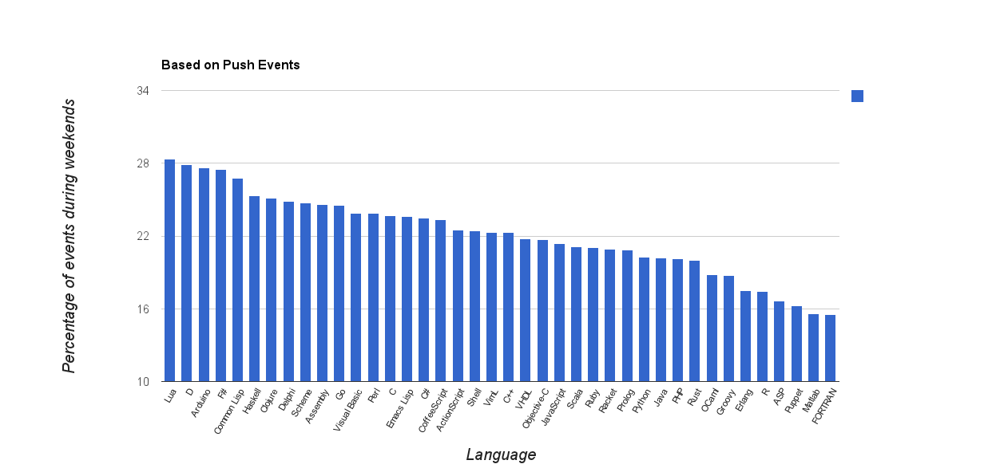
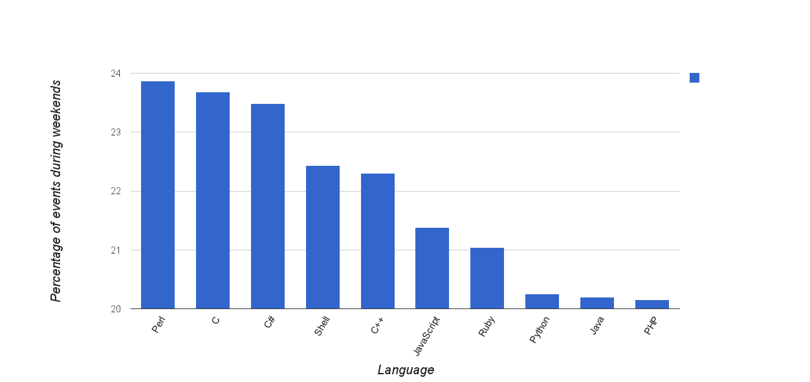
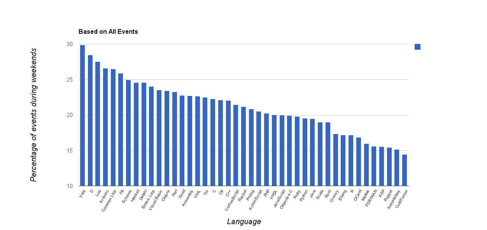
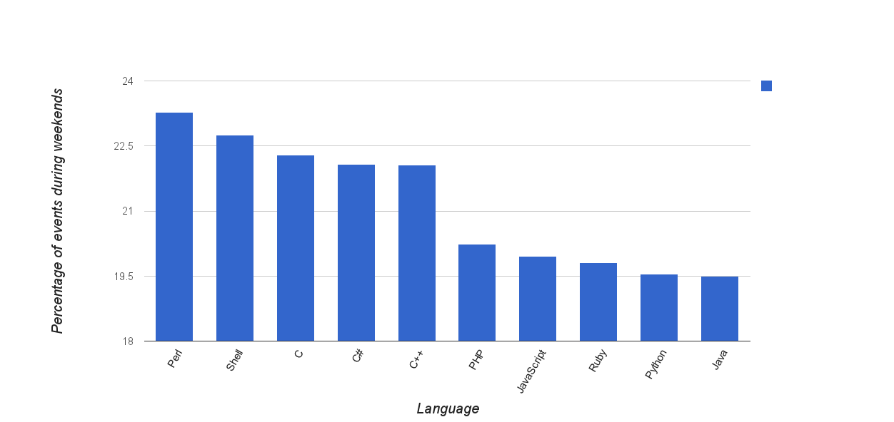

# Weekend Programming Languages

What are the languages used most often during weekends? Are there some languages that are inherently more 'hobbyist' than others?  

I have attempted to answer these questions for this year's [GitHub Data Challenge](https://github.com/blog/1450-the-github-data-challenge-ii).

One way to answer these questions is to survey thousands of programmers about their language use over weekdays and weekends (which might be fairly difficult, or may not be economically viable). But fortunately for us, GitHub records a swath of data from which such information can be mined. Whenever programmers push code to GitHub, or do other activities such as forking, downloading etc., information is recorded.
The data is available as downloadable `json.gz` files at the [GitHub Archive](http://www.githubarchive.org/), or as a dataset at Google BigQuery.

One could argue that of all the type of events performed, `PushEvent`s could indicate the language use better than other events (such as WatchEvents). There are definitely several limitations with this approach but nevertheless, let us stick with this metric. The results when all events are used, is shown in subsequent sections.

### Based on Push Events

Here, in order to avoid too many languages, I counted only those languages which had consistently all non-zero number of events every single day. 

Let us take a moment to digest this information. 
Arduino enjoys a good spot at the top, which makes sense, since it is more of a hobby language than a mainstream one. C, C++, Java and other standard languages seem to be at the middle, which makes sense - lots of professionals, but also lots of hobbyists. 

Next, let us rank this percentage use during weekends for the most popular languages.
Here are the top-ten languages ranked, based only on `PushEvents`  (the number after the language is the number of events).

1. JavaScript,8538319
1. Java,5554016
1. Ruby,5032303
1. Python,4285711
1. PHP,4183326
1. C++,2645128
1. C,2620992
1. Shell,1330710
1. C#,978429
1. Perl,917207

For these languages, the weekend popularity is as follows:

### Based on all Event Types

We could also use all the event types to understand weekend-popularity.
The results are (again, only those languages are considered which are used everyday).

As before, here are top-ten languages counted by aggregating all events (note the difference between this list and the previous list. Objective-C was not there above, but is there in this list; Perl is missing from the above).

1. JavaScript,17310652
1. Ruby,9813411
1. Java,9461813
1. Python,8129598
1. PHP,7678254
1. C,5008085
1. C++,4410267
1. Objective-C,2241348
1. Shell,2064431
1. C#,1831029

The corresponding ranking is as follows:

The complete list (making sure there have been events for at least half of the total number of days):

1. Nimrod,35.4411
1. ooc,34.0698
1. Vala,29.9059
1. D,28.4488
1. Dylan,28.041
1. Lua,27.5552
1. Parrot,26.6202
1. Arduino,26.5816
1. Common Lisp,26.4666
1. F#,25.8841
1. Scheme,24.95
1. Verilog,24.8702
1. Io,24.7242
1. Haskell,24.596
1. Delphi,24.5892
1. Pure Data,24.5808
1. Turing,24.4526
1. SuperCollider,24.2344
1. Dart,24.1175
1. Emacs Lisp,24.0541
1. Arc,23.7705
1. Ada,23.5855
1. Visual Basic,23.5394
1. Clojure,23.4217
1. Perl,23.2815
1. DCPU-16 ASM,22.822
1. AppleScript,22.7723
1. Shell,22.7499
1. Julia,22.7151
1. Assembly,22.6994
1. VimL,22.6768
1. Elixir,22.6761
1. Go,22.5093
1. C,22.2897
1. C#,22.084
1. C++,22.0538
1. Smalltalk,22.003
1. HaXe,21.9992
1. OpenEdge ABL,21.9477
1. Gosu,21.8432
1. Standard ML,21.4867
1. CoffeeScript,21.4702
1. Racket,21.1643
1. Boo,21.0025
1. Prolog,20.8579
1. ActionScript,20.5464
1. PHP,20.2422
1. VHDL,20.0203
1. JavaScript,19.9581
1. Objective-C,19.9352
1. Ruby,19.8123
1. Python,19.5424
1. Java,19.4998
1. Logtalk,19.3459
1. Objective-J,19.3309
1. Scala,18.9675
1. Rust,18.9617
1. PowerShell,18.5705
1. Factor,18.0105
1. Coq,17.8117
1. Groovy,17.3457
1. Erlang,17.1946
1. R,17.1551
1. Kotlin,17.0534
1. OCaml,16.8474
1. XQuery,16.7247
1. Rebol,16.4125
1. Scilab,16.0884
1. Matlab,15.9729
1. FORTRAN,15.5981
1. ASP,15.5426
1. Puppet,15.4394
1. AutoHotkey,15.1776
1. Nemerle,14.9266
1. ColdFusion,14.4573
1. Eiffel,14.0177
1. Apex,11.9424
1. Tcl,11.0578

### Workflow
Thanks to Google BigQuery, it was a breeze to extract the required information from approximately 60GB of data (of course after many days of tinkering with manually downloading data, figuring out what queries to ask etc.). But it wasn't so much of a breeze to download the output so I could further process the outputs. 

The following query lists the number of events per day per language. You can add a `type='PushEvent'` if you want. The downloaded CVS files are in the data folder of the repository.

> `SELECT day, repository_language, COUNT(day) AS count FROM
  (SELECT repository_language, UTC_USEC_TO_DAY(PARSE_UTC_USEC(created_at))/1000000/3600/24 AS day FROM githubarchive:github.timeline WHERE repository_language IS NOT NULL)
GROUP BY day, repository_language
ORDER BY day`;

### Limitations

1. We are looking at programmers who use GitHub and who push their code to GitHub. 
2. There are definitely many programmers who don't use GitHub for their work. 
